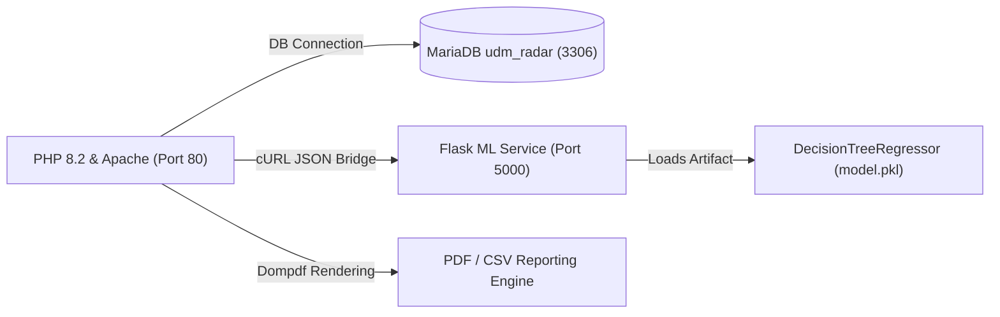
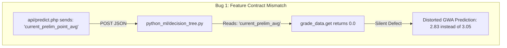
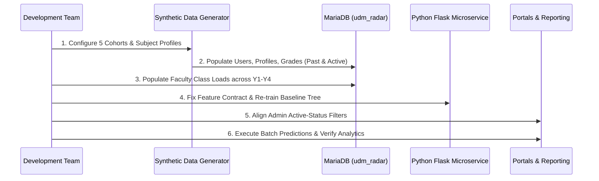

# UDM-RADAR: Comprehensive Repository Audit & 5-Cohort Longitudinal Architecture

**Project**: Universidad de Manila — Risk Analytics & Decision-support for Academic Records (UDM-RADAR)  
**Live Temporal Anchor**: School Year 2026–2027, First Semester (1st Sem)  
**Evaluation Scope**: Capstone Prototype Demonstration on Synthetic Longitudinal Data  
**Document Version**: 2.0.0 (Post-Audit Synthesis)

---

## 1. Executive Summary & Context

### 1.1 Institutional Context & Adviser Authorization
During early system design, the research team planned to validate the predictive engine using historical academic records from the Universidad de Manila (UDM) Registrar. However, the Registrar determined that student grade histories constitute sensitive, private personal information under data privacy regulations and denied institutional data access. 

The Capstone Adviser subsequently authorized the team to proceed with **synthetic (mock) academic records**. This decision maintains the complete operational viability of the UDM-RADAR platform—including Student, Faculty, and Admin portals, grade encoding and approvals, academic support case management, and administrative audit trails.

### 1.2 Core Research Delimitation
> [!IMPORTANT]
> **Prototype Evaluation vs. Validated Real-World Predictive Accuracy**  
> Synthetic data generation allows rigorous functional testing, workflow validation, edge-case resilience verification, and proof-of-concept machine learning prototyping. However, **synthetic records cannot establish real-world predictive validity for actual UDM students**. Any model trained on synthetic data learns the generative rules and statistical distributions introduced by the generator. All capstone documentation, presentation decks, and user interfaces must explicitly label predictive outputs as:  
> `Prototype performance on synthetic academic records` *(never "Validated Institutional Predictions")*.

### 1.3 Purpose of the 5-Cohort Expansion
The existing database contains approximately 291 student accounts, of which 288 belong exclusively to 3rd-year sections `IT-31` through `IT-38` (Cohort 2024). Years 1 and 2 are completely absent, and Year 4 contains only 3 static records. 

Expanding the synthetic environment to **5 longitudinal cohorts across Years 1 to 4 (Cohorts 2022–2026)** accomplishes key academic and technical goals:
1. **Curricular Topology Demonstration**: Spans all 58 BSIT subjects across all 8 semesters.
2. **Repeated Subject Offerings**: Demonstrates that the analytics module (`admin/analytics.php`) can track subject performance profiles across multiple academic years.
3. **Multi-Horizon Prediction Testing**:
   - **Freshmen (Cohort 2026)**: Evaluates the zero-history boundary ("Insufficient Academic Data" / fallback heuristic).
   - **Sophomores (Cohort 2025)**: Evaluates early-warning predictions with 1 year of historical GWA.
   - **Juniors (Cohort 2024)**: Evaluates mid-program projections with 2 years of historical GWA.
   - **Seniors (Cohort 2023)**: Evaluates graduation readiness and isolates Capstone/OJT special requirements.
   - **Graduated Baseline (Cohort 2022)**: Establishes a completed 4-year ground truth for historical comparison.
4. **Non-Trivial Machine Learning**: Eliminates single-batch overfitting and avoids synthetic formulas that make prediction artificially trivial.

---

## 2. Environment & System Setup Verification

In accordance with [SETUP.md](file:///C:/xampp/htdocs/udm-radar/SETUP.md) and [CONTRIBUTING.md](file:///C:/xampp/htdocs/udm-radar/CONTRIBUTING.md), the local development environment has been audited, repaired, and verified:



| Component | Target Requirement | Live State | Verification Result |
| :--- | :--- | :--- | :--- |
| **PHP Runtime** | PHP 8.2 (XAMPP) | PHP 8.2.12 | **PASS**: Executable in `C:\xampp\php\php.exe` |
| **`php.ini` Settings** | `gd`, `zip`, `pdo_mysql`, `mbstring` | `gd` & `zip` un-commented; `pdo_mysql` active | **PASS**: Verified via CLI runtime check |
| **Timezone** | `Asia/Manila` (PST, UTC+8) | Previously `Europe/Berlin`, corrected to `Asia/Manila` | **PASS**: Synchronized across PHP and MySQL |
| **Memory Limit** | Min 256M for Dompdf | `512M` | **PASS**: Sufficient for multi-page PDF generation |
| **Database** | MariaDB 10.4.32 | 17 core tables + `export_audit_logs` | **PASS**: Clean import of latest schema dump |
| **Schema Integrity** | Discrete points / text statuses | `grades.final_grade` VARCHAR(10) | **PASS**: Prevents `INC`/`DO`/`DU` coercion to `0.00` |
| **Composer / PDF** | Dompdf 3.1.6 | `vendor/autoload.php` present | **PASS**: Autoloader verified and active |
| **Python ML Env** | Python 3.14 + venv | `python_ml/venv` with scikit-learn, pandas, flask | **PASS**: Flask daemon active on port 5000 (`/health` OK) |
| **Syntax Audit** | Zero lint/parse errors | 48 project PHP files checked via `php -l` | **PASS**: 100% syntax compliance across codebase |

---

## 3. Codebase Architecture & Workflow Audit

### 3.1 Academic Rules & Grading Conventions ([`config/constants.php`](file:///C:/xampp/htdocs/udm-radar/config/constants.php))
- **Scale Definition**: UdM operates on a $1.00$ (Passing / $75\%$) to $4.00$ (Excellent / $99\text{--}100\%$) scale. Grades below $1.75$ are considered high risk / failing.
- **Term Grades vs. Final Grade**:
  - Preliminary, Midterm, and Pre-Final are strictly raw percentages ($0\text{--}100$).
  - Final Grade is either an official point grade ($4.00, 3.75, \dots, 1.00$) or an authorized institutional status (`INC`, `DO`, `DU`, `DRP`, `PASSED`).
- **Official Computation**:
  $$\text{Final Percentage} = (\text{Prelim} \times 0.30) + (\text{Midterm} \times 0.30) + (\text{Pre-Final} \times 0.40)$$
  Converted to point grade via `convertPercentageToPoint()`.
- **Weighted GWA Calculation**:
  $$\text{GWA} = \frac{\sum (\text{Point Grade}_i \times \text{Units}_i)}{\sum \text{Units}_i}$$
  *Rule*: Non-numeric statuses (`INC`, `DO`, `DU`) are excluded from GWA weighting to avoid distorting the academic average.
- **Risk Triage Cutoffs**:
  - $\text{GWA} \ge 2.50 \implies \text{LOW Risk}$ (Very Satisfactory to Excellent)
  - $1.75 \le \text{GWA} < 2.50 \implies \text{MODERATE Risk}$ (Satisfactory)
  - $\text{GWA} < 1.75 \implies \text{HIGH Risk}$ (Fair / Failing)

### 3.2 Dual-Mode Analytics Architecture ([`admin/analytics.php`](file:///C:/xampp/htdocs/udm-radar/admin/analytics.php))
The analytics engine operates in two mutually exclusive modes based on the active term filter:
- **Mode A: Live In-Progress Term (`2026-2027`, Sem 1)**:
  - Joins `student_profiles` with `predictions` (latest timestamp/ID) and active enrolled grades (`is_current = 1`).
  - Displays real-time risk distribution, Dean's List / Latin Honor readiness, and subject preliminary grade bottlenecks.
- **Mode B: Historical Completed Terms (e.g., `2024-2025`, `2025-2026`)**:
  - Queries finalized historical records (`is_current = 0`) where `final_grade IS NOT NULL`.
  - Computes cohort passing rates, failure rates, non-numeric status frequencies, and average official point grades.

### 3.3 Grade Workflow & Administrative Audit
1. **Faculty Grade Encoding** ([`faculty/grades.php`](file:///C:/xampp/htdocs/udm-radar/faculty/grades.php)):
   - Restricted by row-level authorization to assigned subject and section in `faculty_class_loads`.
   - Preliminary, Midterm, and Pre-Final submissions enter `pending_grade_batches`.
2. **Administrator Approval** ([`admin/grades.php`](file:///C:/xampp/htdocs/udm-radar/admin/grades.php)):
   - Admin inspects pending batches, verifies term percentage bounds ($0\text{--}100$), and approves or rejects.
   - On approval, writes to `grades`, recalculates student GWA, and logs actions into `admin_change_log`.
3. **Intervention Lifecycle** ([`admin/activity.php`](file:///C:/xampp/htdocs/udm-radar/admin/activity.php)):
   - High-risk predictions in `api/batch_predict.php` automatically create an `academic_support_cases` ticket (`status = 'needs_review'`).
   - Admin/Faculty assign referrals (`support_case_referrals`), notify the student, and require student receipt acknowledgment (`support_status_history`).

---

## 4. Critical Audit Findings & Architectural Gaps

During our in-depth audit of the prediction bridge, ML microservice, and administrative views, four critical defects and structural gaps were identified:



### Gap 1: Silent ML Feature Contract Mismatch (High Severity)
- **Root Cause**: In [`api/predict.php`](file:///C:/xampp/htdocs/udm-radar/api/predict.php#L92), the PHP bridge constructs the feature payload with key `'current_prelim_point_avg'`. However, [`python_ml/decision_tree.py`](file:///C:/xampp/htdocs/udm-radar/python_ml/decision_tree.py#L23) reads `grade_data.get('current_prelim_avg', 0)`.
- **Impact**: Because Python’s `.get()` falls back to `0.0`, the preliminary point average was silently dropped to zero during live inference! For example, a student with a historical GWA of `3.07` and a current prelim of `2.91` was predicted at `2.83` (assuming prelim $= 0$) instead of their true predicted GWA of `3.05`.
- **Secondary Impact**: In [`python_ml/app.py`](file:///C:/xampp/htdocs/udm-radar/python_ml/app.py#L29), candidate model upload checks for `current_prelim_point_avg`, whereas [`python_ml/training_data.csv`](file:///C:/xampp/htdocs/udm-radar/python_ml/training_data.csv#L1) contains `current_prelim_avg`, causing staging validation to reject the dataset.
- **Required Fix**: Harmonize the feature naming across PHP, `app.py`, `decision_tree.py`, and `training_data.csv`. Support fallback key aliases defensively in `decision_tree.py`.

### Gap 2: Overwritten Training Script (Medium Severity)
- **Root Cause**: [`python_ml/train_model.py`](file:///C:/xampp/htdocs/udm-radar/python_ml/train_model.py) was accidentally overwritten in a previous commit with the contents of `decision_tree.py`. The training logic (train/test split, regression metrics calculation, and serialization to `model.pkl`) was completely severed from the CLI.
- **Required Fix**: Restore the training pipeline script with regression evaluation (MAE, RMSE, $R^2$), tree rule export, and candidate staging support.

### Gap 3: Stale Lifecycle Filter Logic in Admin Pages (Medium Severity)
- **Root Cause**: Database migration `001_add_student_record_status.sql` introduced `student_profiles.record_status` (`Active`, `Archived`, `Graduated`) to separate account lifecycle from academic progress (`status` = `Regular`/`Irregular`). While several queries were updated, filter dropdowns in [`admin/index.php`](file:///C:/xampp/htdocs/udm-radar/admin/index.php#L28) and [`admin/faculty.php`](file:///C:/xampp/htdocs/udm-radar/admin/faculty.php#L249) still query `WHERE status != 'Archived'`.
- **Impact**: Graduated and archived students continue to appear in active section and year-level filter dropdowns.
- **Required Fix**: Align all active-population filter queries to `WHERE record_status = 'Active'`.

### Gap 4: Year-Level Isolation in Faculty Class Loads (Architecture Constraint)
- **Root Cause**: The current `faculty_class_loads` table assigns all 4 faculty members strictly to 3rd-year subjects and sections (`IT-31` to `IT-38`).
- **Impact**: Once 1st, 2nd, and 4th-year sections are populated, faculty members cannot encode grades or view students in those years due to row-level security checks in `api/predict.php` and `faculty/grades.php`.
- **Required Fix**: Expand `faculty_class_loads` to distribute faculty teaching assignments across all 4 year levels.

---

## 5. The 5-Cohort Longitudinal Architecture

To represent the full BSIT degree lifecycle, the synthetic academic environment is organized into **five distinct longitudinal cohorts** anchored to **School Year 2026–2027, 1st Semester**:

```
Academic Year Progression:
SY 2022-2023 ───► SY 2023-2024 ───► SY 2024-2025 ───► SY 2025-2026 ───► SY 2026-2027 (LIVE ANCHOR)
┌──────────────┐
│ Cohort 2022  │ Y1S1 / Y1S2     Y2S1 / Y2S2     Y3S1 / Y3S2     Y4S1 / Y4S2     [GRADUATED / ARCHIVED]
└──────────────┘
               ┌──────────────┐
               │ Cohort 2023  │ Y1S1 / Y1S2     Y2S1 / Y2S2     Y3S1 / Y3S2     [Y4S1 ACTIVE] (Seniors)
               └──────────────┘
                              ┌──────────────┐
                              │ Cohort 2024  │ Y1S1 / Y1S2     Y2S1 / Y2S2     [Y3S1 ACTIVE] (Juniors - Existing 288)
                              └──────────────┘
                                             ┌──────────────┐
                                             │ Cohort 2025  │ Y1S1 / Y1S2     [Y2S1 ACTIVE] (Sophomores)
                                             └──────────────┘
                                                            ┌──────────────┐
                                                            │ Cohort 2026  │ [Y1S1 ACTIVE] (Freshmen)
                                                            └──────────────┘
```

### 5.1 Cohort Topology & Curriculum Mapping

The 58 curriculum subjects in the `subjects` table map across the 5 cohorts as follows:

| Cohort | Academic Intake | Completed Terms (`is_current = 0`) | Live Active Term (`is_current = 1`) | Status in Live Anchor | Sections | Student Role / Demo Purpose |
| :--- | :--- | :--- | :--- | :--- | :--- | :--- |
| **Cohort 2022** | SY 2022–2023 1st Sem | 8 Terms (Y1S1 to Y4S2: 58 subjects) | None | `Graduated` / Inactive | `IT-41G`–`IT-43G` | Completed 4-year baseline; repeated subject analytics |
| **Cohort 2023** | SY 2023–2024 1st Sem | 6 Terms (Y1S1 to Y3S2: 51 subjects) | Year 4 Sem 1 (6 subjects) | `Active` (4th Year) | `IT-41`, `IT-42`, `IT-43` | Senior graduation readiness, Capstone 2, 3-yr prediction |
| **Cohort 2024** | SY 2024–2025 1st Sem | 4 Terms (Y1S1 to Y2S2: 35 subjects) | Year 3 Sem 1 (8 subjects) | `Active` (3rd Year) | `IT-31` to `IT-38` | Existing 288 students; midline prediction with 2-yr history |
| **Cohort 2025** | SY 2025–2026 1st Sem | 2 Terms (Y1S1 to Y1S2: 17 subjects) | Year 2 Sem 1 (9 subjects) | `Active` (2nd Year) | `IT-21` to `IT-24` | Early bottleneck tracking (OOP, Discrete Math, DBMS 1) |
| **Cohort 2026** | SY 2026–2027 1st Sem | 0 Terms (Freshmen Intake) | Year 1 Sem 1 (8 subjects) | `Active` (1st Year) | `IT-11` to `IT-14` | Zero-history boundary; tests fallback heuristic & alerts |

### 5.2 Curricular Subject Distribution (58 Total Subjects)
1. **Year 1, Sem 1 (8 subjects, 21 units)**: GED101, GED102 (Math Modern World), GED104 (Ethics), ITE111 (Intro Computing), ITE112 (Fund. of Programming), PE101, NST101, UID101 (Manila Studies).
2. **Year 1, Sem 2 (9 subjects, 24 units)**: GED103, RZL101 (Rizal), MST101, ITE114 (Info Mgmt), ITE115 (Data Structures & Alg), ITE113 (Intermediate Prog), PE102, NST102, UID102.
3. **Year 2, Sem 1 (9 subjects, 24 units)**: GED105, GED106, SSP101, ITE221 (DBMS 1), ITE222 (Discrete Math), ITE232 (Web Dev 1), ITE231 (OOP), PE103, UID103.
4. **Year 2, Sem 2 (9 subjects, 24 units)**: GED107, GED108, AHM101, ITE216 (App Dev), ITE233 (Operating Systems), PE104, ITE223 (Integrative Prog 1), ITE234 (DBMS 2), UID104.
5. **Year 3, Sem 1 (8 subjects, 22 units)**: ITE321 (Info Security 1), ITE322 (Networking 1), ITE323 (HCI), ITE331 (SAD), ITE332 (Seminar in IT), ITE341 (Stats & Probability), SD351 (Machine Learning), UID105.
6. **Year 3, Sem 2 (8 subjects, 22 units)**: ITE324 (Info Security 2), ITE325 (Networking 2), ITE326 (Capstone 1), ITE327 (SysAdmin), ITE328 (Quant Methods), SD352 (Web Dev 2), SD353 (Software Dev), UID106.
7. **Year 4, Sem 1 (6 subjects, 16 units)**: ITE431 (Sys Integration), ITE421 (Social Issues), ITE422 (Capstone 2), SD354 (Platform Tech), ITE441 (Technopreneurship), UID107.
8. **Year 4, Sem 2 (1 subject, 6 units)**: ITE423 (Industry Immersion / OJT, 6 units).

---

## 6. Synthetic Data Generator Specification

### 6.1 Avoiding the Trivial Machine-Learning Trap
If the data generator sets final GWA using a direct equation like $\text{GWA} = 0.70 \times \text{HistGWA} + 0.30 \times \text{Prelim}$, the Decision Tree will merely memorize this linear formula with near-zero error. That produces an artificially simple, unrealistic machine learning model.

To create realistic academic records, student generation must model:
1. **Latent Academic Profiles (Archetypes)**:
   - **High Achiever (15%)**: Baseline capability $3.25\text{--}3.85$. Low variance across semesters ($\sigma = 0.15$). High resilience in difficult subjects.
   - **Solid Average (60%)**: Baseline capability $2.00\text{--}2.80$. Moderate variance ($\sigma = 0.25$). Passes most subjects; occasional fair grade in challenging courses.
   - **Struggling / At-Risk (15%)**: Baseline capability $1.25\text{--}1.85$. High variance ($\sigma = 0.35$). Frequent borderline grades, repeated courses, and academic probation.
   - **Dynamic Trajectories (10%)**:
     - *Rebounders*: Start poorly in Year 1 ($1.25\text{--}1.60$) and steadily improve by Year 3 ($2.50\text{--}3.00$).
     - *Late Burnouts*: Perform well in Year 1/2 ($3.00\text{--}3.50$) but experience performance declines in upper-year technical subjects ($1.50\text{--}1.80$).
2. **Historical Subject Performance Profiles**:
   - Inherent difficulty adjustment: Technical bottleneck courses (e.g., `ITE115` Data Structures, `ITE222` Discrete Math, `ITE231` OOP, `ITE341` Stats) apply a negative offset ($-0.20$ to $-0.35$ grade points) and higher variance.
   - Foundational courses (`UID101`–`UID107`, PE, NSTP) have high completion rates and positive offsets ($+0.25$ grade points).
3. **Term Score Evolution & Natural Noise**:
   - Prelim scores correlate with final grades ($r \approx 0.65\text{--}0.75$), but are not deterministic.
   - Students recover through midterms and pre-finals, or decline due to project deadlines.
4. **Special Academic Statuses**:
   - Realistic insertion of non-numeric outcomes: Incompletes (`INC`), Drops (`DO`), and Unofficial Drops (`DU`) on $1\text{--}3\%$ of historical records, testing that the system never casts them to numeric `0.00`.

---

## 7. Implementation Roadmap & Action Plan



### Phase 1: Codebase Patching & Contract Harmonization
1. **Fix `api/predict.php` & `decision_tree.py`**:
   - Harmonize feature name to `current_prelim_point_avg` (with fallback to `current_prelim_avg`).
   - Retain backward compatibility so model inference never defaults prelim to zero.
2. **Restore `python_ml/train_model.py`**:
   - Implement regression training script that outputs MAE, RMSE, and $R^2$.
   - Train on the synchronized feature schema and save clean `model.pkl`.
3. **Patch Administrative Filter Queries**:
   - Update `admin/index.php` and `admin/faculty.php` from `status != 'Archived'` to `record_status = 'Active'`.

### Phase 2: Synthetic Longitudinal Data Generator Execution
1. **Retain Existing Cohort 2024**: Keep the 288 Year 3 active student records (`IT-31` to `IT-38`) intact to preserve ongoing work.
2. **Synthesize Cohort 2022 (Graduated Baseline)**:
   - 60 students, 8 completed semesters (SY 2022–2023 to SY 2025–2026).
   - Set `record_status = 'Graduated'`, `is_active = 0`.
3. **Synthesize Cohort 2023 (Seniors / 4th Year)**:
   - 90 students across sections `IT-41`, `IT-42`, `IT-43`.
   - 6 completed semesters (SY 2023–2024 to SY 2025–2026), 1 active term (SY 2026–2027 Sem 1).
4. **Synthesize Cohort 2025 (Sophomores / 2nd Year)**:
   - 120 students across sections `IT-21`, `IT-22`, `IT-23`, `IT-24`.
   - 2 completed semesters (SY 2025–2026), 1 active term (SY 2026–2027 Sem 1).
5. **Synthesize Cohort 2026 (Freshmen / 1st Year)**:
   - 120 students across sections `IT-11`, `IT-12`, `IT-13`, `IT-14`.
   - 0 completed semesters, 1 active term (SY 2026–2027 Sem 1).
6. **Assign Multi-Year Faculty Class Loads**:
   - Map existing faculty accounts (`Ronald Fernandez`, `John Rey Consulta`, etc.) across Year 1, 2, 3, and 4 sections.

### Phase 3: Comprehensive End-to-End Verification
1. **Prediction Execution**: Trigger `api/batch_predict.php` to generate predictions for all active students (Years 1 to 4).
2. **Insufficient Data Verification**: Confirm Freshmen with 0 historical terms trigger `calculation_fallback` without crashing.
3. **Dual-Mode Analytics Verification**: Confirm `admin/analytics.php` correctly toggles between Mode A (current term sections) and Mode B (historical subject performance profiles across past school years).
4. **Export Validation**: Verify CSV and PDF downloads for Program Risk Roster, Subject Performance, and Program Analytics.

---

## 8. Work Package Remediation Ledger & Defect Registry

| Work Package | Title | Status | Core Commit | Scope Boundaries Enforced |
| :--- | :--- | :--- | :--- | :--- |
| **WP-0** | Baseline Freeze & Verification | **Approved** | `1ee0b9e`, `d989c1b` | No model replacement, no DB migration. |
| **WP-1** | Database Migrations & Table Recovery | **Approved** | `7563584`, `7e2c6d4` | Migrations 000–004 idempotent on scratch DB; live DB untouched. |
| **WP-2** | Canonical Final Grade Vocabulary & Helper Layer | **Approved** | `b16282d`, `8f3d14e`, `401ac94` | Shared helpers in `config/constants.php`; numeric-only term percentages; canonicalization; test suite preserved in repository. |
| **WP-4** | GWA Parity, Analytics Reconciliation & Historical Reports | **Approved** | `44e788a`, `f077fa4`, `23cc61c`, `107c9b8`, `882f2fd`, `6e9c939` | Centralize unit-weighted GWA, resolve duplicate recalculations, fix historical pass rate, reconcile faculty lifecycle queries, exclude DRP from pass-rate denominator, add audit tool. |
| **WP-3** | Database Column Migration (`VARCHAR(10)`) | **Approved** | `f0bc2c0`, `ed7b13c`, `023b48e`, `12ba47d` | Migration 005 standardizes grades.final_grade to VARCHAR(10) with exact-match BINARY CHECK constraint. Pre-migration audit, idempotent on scratch DB; live DB untouched. |
| **WP-6** | Student Course Value and Curriculum-Track Repair | **Approved** | `fa21e7d`, `6087663`, `ea63266`, `35e1a09`, `9085ae5` | Migration 006 standardizes student_profiles.course to ENUM with CHECK constraint; repairs synthetic profiles to 'BSIT - Software Development'; derives LOCKED_COURSE; audits elective consistency; live DB untouched. |
| **WP-5** | Prediction Source & Feature Harmonization | **Approved** | `03c78c1`, `e1dc6d0`, `1d30e5c`, `524945a`, `e2e9b9f`, `efc7db3`, `46731d1` | Canonical feature contract `current_prelim_point_avg` with alias `current_prelim_avg`; eliminated silent 0.0 feature injection; standardized stored sources (`decision_tree`, `heuristic`, `calculation_fallback`) via Migration 007 as VARCHAR(30) NOT NULL with NO permanent default (rejects omission on insert); binary CHECK constraints on predictions and academic_support_cases; reconciled fallback formula to canonical 50/50 blend snapped to 0.25; separated user labels (AI-Based Projection, Calculation-Based Estimate) from diagnostic labels; preserved 405 legacy rows as `heuristic`; zero-rebuild verified; `model.pkl` and `model_metrics.json` untouched (retraining deferred to WP-7); live DB untouched. |
| **Generator** | 5-Cohort Longitudinal Data Generator | **BLOCKED** | — | Generator remains blocked until all prerequisites through WP-9 are completed. Official curriculum verification required before multi-track generation. |

### Registered Defect Remediation Log

1. **[DEFECT-WP4-01] Historical Pass-Rate Misclassification (RESOLVED in WP-4)**:
   - **Location**: `admin/analytics.php` and `admin/export_program_analytics_pdf.php`.
   - **Prior State**: Evaluated `$pt > 0` as passed, incorrectly treating failing grades (`1.00`, `1.25`, `1.50`) as passes.
   - **Resolution**: Replaced with `isPassingFinalGrade()` and `isFailingFinalGrade()`. Point grades $< 1.75$ and failing textual statuses are correctly classified as failed.
   - **Pass-Rate Denominator Correction**: `DRP` (dropped), `NULL`, blanks, and unparseable codes are strictly excluded from the pass-rate denominator (`recognized_outcome_count = passed + failed`).
   - **Outcome Buckets**: 7 explicit buckets tracked (`numeric_count`, `numeric_pass_count`, `nonnumeric_pass_count`, `failing_count`, `dropped_count`, `missing_or_invalid_count`, `recognized_outcome_count`). Tested via Scenarios A, B, C, D in unit test suite.

2. **[DEFECT-WP6-01] Synthetic Student Course Representation & Live Blank Values (RESOLVED in WP-6)**:
   - **Location**: `student_profiles.course`, `admin/students.php`, `admin/activity.php`, `config/constants.php`.
   - **Prior State**: Synthetic 3rd-year students held generic `'Bachelor of Science in Information Technology'` while Year 4 reference student held `'BSIT (Software Development)'`. In live `udm_radar`, an uncommitted ENUM modification under non-strict SQL mode silently coerced 290 student records into empty strings `''`.
   - **Resolution**: Implemented Migration 006 with pre-migration verification, temporary safety backup table `_backup_student_profiles_course_wp6`, standardizing all synthetic profiles to `'BSIT - Software Development'`, converting the column to `ENUM('BSIT - Software Development', 'BSIT - Data Science', 'BSIT - Cyber Security') NOT NULL DEFAULT 'BSIT - Software Development'` and attaching `chk_student_profiles_course_valid` to reject blanks even under non-strict SQL mode.
   - **Official Schema Count**: The application schema consists strictly of **18 base tables**. The migration backup table `_backup_student_profiles_course_wp6` (temporarily creating a 19th table in scratch) is a temporary migration artifact, exported to `backups/backup_student_profiles_course_wp6.sql` (checksum `9a5031f36656af748e655d61e96c816d`), and scheduled for deletion prior to WP-9 canonical dump consolidation.
   - **Population Distinctions**:
     - *Committed Baseline & Scratch*: 289 student profiles (288 Year 3 synthetic students in `IT-31` to `IT-38`, 1 Year 4 reference student UID 5 in `IT-43`).
     - *Live Development Database*: 291 student profiles (290 blank `''`, 1 valid `'BSIT - Software Development'`). The two live-only profiles (Live-only profile A / User ID 300, Live-only profile B / User ID 301) are documented for pre-maintenance inspection; live records remain completely untouched.
   - **Synthetic Course Allocation & Curriculum Policy**: The existing synthetic records are assigned Software Development for internal prototype consistency. This is not evidence of actual UDM section-to-track allocation. Track and elective mappings (SD351 *Machine Learning*, SD352 *Web Development 2*, SD353 *Software Development*, SD354 *Platform Technologies*) represent verified repository baseline records from prototype development, but are classified as synthetic placeholder curricula. Official track-curriculum verification is registered as a mandatory prerequisite before multi-track cohort generation.
   - **Application Code Hardening**: Updated `LOCKED_COURSE` in `admin/students.php` to derive directly from canonical `COURSE_PROGRAMS[0]`, added course validation in `admin/activity.php`, and introduced `isValidCourse()` in `config/constants.php`. Verified 100% elective coherence for SD351 across all 289 profiles.

3. **[DEFECT-WP5-01] Feature Contract Drift and Missing-Feature Zero Injection (RESOLVED in WP-5)**:
   - **Location**: `python_ml/decision_tree.py`, `python_ml/app.py`, `api/predict.php`.
   - **Prior State**: Feature naming drift existed between API documentation/Flask training expectations (`current_prelim_point_avg`) and serialized `model.pkl` features (`current_prelim_avg`). When features were absent or null, `api/predict.php` injected fallback zeroes (`$historicalGwa ?? 0.0`), corrupting risk prediction calculations into artificial high-risk/failing scores. In Flask, missing feature validation was loose, allowing missing features to cause unhandled exceptions or zero-coerced classifications.
   - **Resolution**: Standardized canonical feature contract to `current_prelim_point_avg` while preserving `current_prelim_avg` as backward-compatible alias. Replaced silent `0.0` injection in `api/predict.php` with strict presence validation—if required inputs are missing, PHP directly uses deterministic calculation fallback and skips calling Flask with artificial values. In Flask `app.py` and `decision_tree.py`, missing or invalid features strictly return HTTP 400 Bad Request with informative diagnostic error messages.

4. **[DEFECT-WP5-02] Prediction Source Vocabulary Drift & Fallback Formula Discrepancy (RESOLVED in WP-5)**:
   - **Location**: `config/constants.php`, `database/migrations/007_harmonize_prediction_source.sql`, `python_ml/decision_tree.py`, `student/dashboard.php`, `student/index.php`.
   - **Prior State**: Disparate prediction sources existed across codebase (`decision_tree`, `heuristic`, `fallback_blend`, `calculation_fallback`). Baseline database dump lacked `prediction_source` column entirely; live database had an unmigrated two-member enum without check constraints. Furthermore, a critical mathematical discrepancy existed between PHP fallback blend (50/50 prelim/hist_gwa clamped [1.00, 4.00] and snapped to 0.25) and Python fallback formula (`0.70 * hist_gwa + 0.30 * prelim`).
   - **Resolution**: Centralized canonical stored sources (`decision_tree`, `heuristic`, `calculation_fallback`) in `config/constants.php` with boundary mapper (`fallback_blend` -> `calculation_fallback`). Standardized Python `_fallback_predict()` to match canonical 50/50 blend snapped to 0.25. Created Migration 007 adding `prediction_source VARCHAR(30) NOT NULL` with NO permanent default and exact-match `chk_predictions_source_valid` and foreign case check constraints; verified 100% idempotent execution on scratch DB (405 legacy rows preserved as `heuristic`). Separated user-facing labels (`AI-Based Projection`, `Calculation-Based Estimate`) from internal diagnostic labels, and standardized source family grouping (`model` vs `calculation`).
   - **DDL Transactional Safety**: MariaDB DDL operations cause implicit commits; safety is enforced via pre-audit queries that terminate with `SIGNAL SQLSTATE '45000'` before DDL execution, idempotent DDL clauses, and documented compensatory actions.
   - **Deferred Work**: Preserved existing `model.pkl` and `model_metrics.json` without retraining; model retraining and stale prediction recalculation are explicitly reserved for WP-7.

### Registered Future Maintenance Tasks

1. **[MAINT-LIVE-GWA] Controlled Backfill of 29 Stale Cached GWA Values on Live Database**:
   - **Context**: 29 live student profiles retain historical cached `current_gwa` values (26 due to legacy `0.00` inclusion, 3 due to legacy unweighted averaging).
   - **Policy**: Live database was accessed strictly read-only for audit; no live rows were modified in WP-4.
   - **Controlled Maintenance Procedure**:
     1. Back up live `current_gwa` values from `student_profiles`.
     2. Run the read-only parity report via `tools/audit_gwa_parity.php --db=udm_radar --allow-live-read-only`.
     3. Review the affected synthetic student profiles.
     4. Obtain formal stakeholder approval for the maintenance window.
     5. Backfill only `current_gwa` through the canonical calculation.
     6. Rerun parity verification to confirm 100% parity.
     7. Preserve before-and-after audit evidence.

2. **[MAINT-WP9-CLEANUP] Mandatory Pre-Export Backup-Table Cleanup Gate**:
   - **Context**: Migration and parity tools utilize temporary `_backup_%` tables during testing and verification (e.g. `_backup_student_profiles_course_wp6`, `_backup_student_profiles_gwa_wp4`).
   - **Mandatory Pre-Export Gate Query**:
     ```sql
     SELECT TABLE_NAME
     FROM information_schema.TABLES
     WHERE TABLE_SCHEMA = DATABASE()
       AND TABLE_NAME LIKE '\_backup\_%';
     ```
   - **Gate Requirement**:
     1. Verify all required evidence is preserved outside the database (e.g., in gitignored `backups/`).
     2. Drop all temporary backup tables: `DROP TABLE IF EXISTS _backup_student_profiles_course_wp6, _backup_student_profiles_gwa_wp4;`.
     3. Confirm the pre-export gate query returns **0 rows**.
     4. Confirm `information_schema.TABLES` reports exactly **18 application base tables**.
     5. Only then regenerate canonical dump [`database/udm_radar.sql`](file:///C:/xampp/htdocs/udm-radar/database/udm_radar.sql), ERD, and Data Dictionary.


